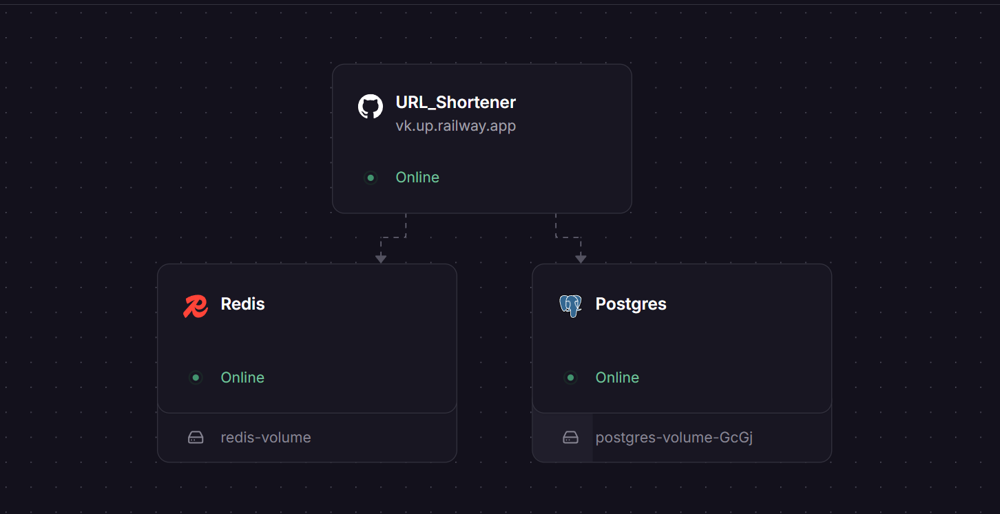
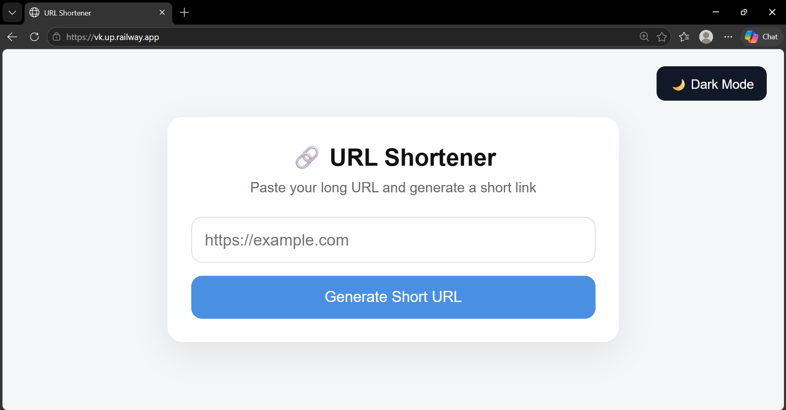
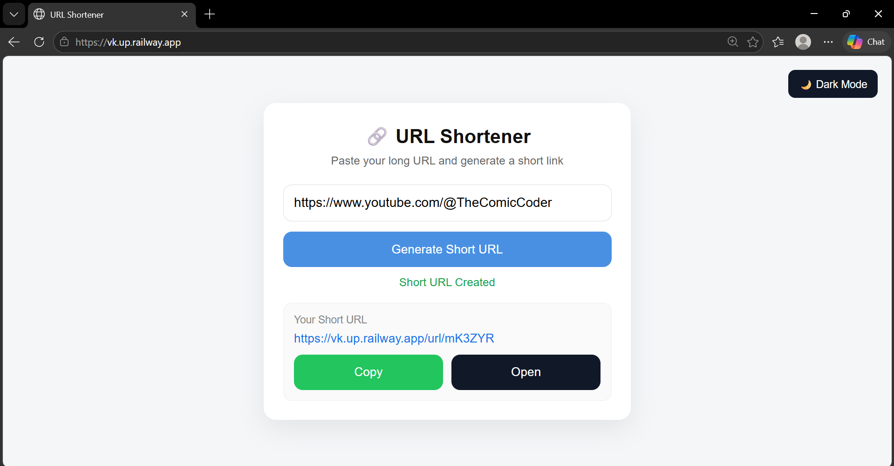
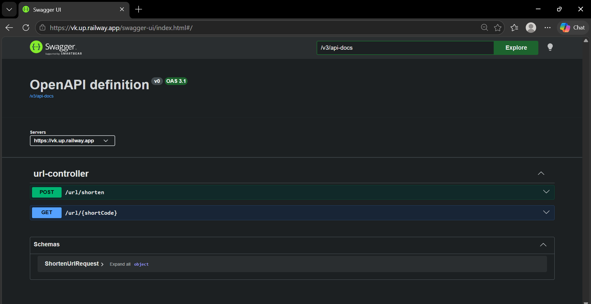
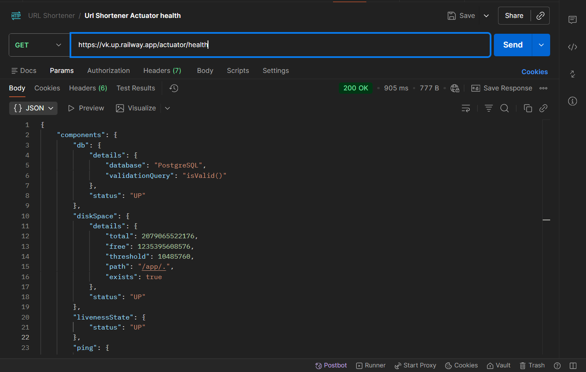
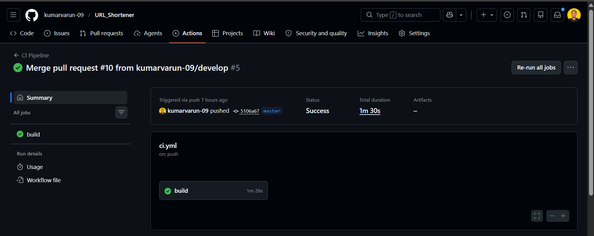
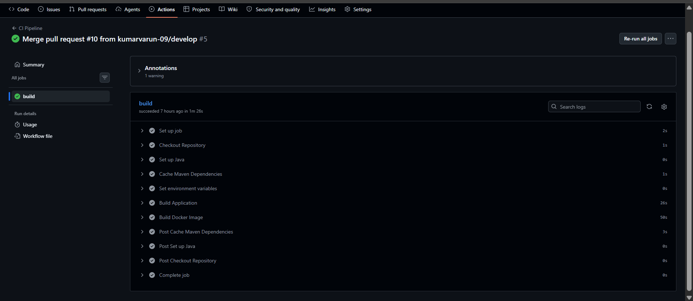

# URL Shortener

A production-oriented URL Shortener backend built using Spring Boot, PostgreSQL, Redis, Docker, and GitHub Actions CI.

This project focuses on backend engineering concepts such as caching, rate limiting, scheduled jobs, environment-driven configuration, containerization, CI automation, and scalable API design.

The application is currently deployed on Railway using managed PostgreSQL and Redis services.

---

# Live Demo

## Application

```text
https://vk.up.railway.app
```

## Swagger UI

```text
https://vk.up.railway.app/swagger-ui/index.html
```

## Health Endpoint

```text
https://vk.up.railway.app/actuator/health
```

---

# Features

* Generate short URLs
* Redirect short URLs to original URLs
* Redis-based caching for low-latency redirects
* IP-based rate limiting
* Click analytics tracking
* Scheduled analytics synchronization job
* Swagger/OpenAPI documentation
* Dockerized setup
* Production profile configuration
* Health monitoring using Spring Boot Actuator
* GitHub Actions CI pipeline for automated build validation
* Lightweight frontend interface for interacting with backend APIs

---

# Tech Stack

## Backend

* Java
* Spring Boot
* Spring Data JPA

## Database & Cache

* PostgreSQL
* Redis

## Documentation & Monitoring

* Swagger / OpenAPI
* Spring Boot Actuator

## DevOps

* Docker
* Docker Compose
* GitHub Actions

---

# Architecture Overview

```text
Client / Browser
        ↓
Spring Boot API
        ↓
Redis Cache
        ↓
PostgreSQL
```



---

# Redirect Flow

```text
1. Client requests short URL
2. Application checks Redis cache
3. On cache miss, data is fetched from PostgreSQL
4. User is redirected to original URL
5. Cache is updated for future requests
```

---

# Example URLs

## Original URL

```text
https://www.youtube.com/@TheComicCoder
```

## Generated Short URL

```text
https://vk.up.railway.app/url/mK3ZYR
```

---

# Lightweight Client Interface

The project also includes a lightweight frontend interface for interacting with backend APIs.



Supported actions:

* Enter original URL
* Generate short URL
* Copy generated short URL
* Open generated short URL directly



---

# API Documentation

## Swagger UI

```text
https://vk.up.railway.app/swagger-ui/index.html
```



---

## Health Check

```text
https://vk.up.railway.app/actuator/health
```



---

## Redirect Endpoint

```text
GET /url/{shortCode}
```

Example:

```text
GET /url/mK3ZYR
```

---

# CI Pipeline

The project includes a GitHub Actions CI pipeline that:



* validates Maven builds on push and pull requests
* caches Maven dependencies for faster builds
* verifies Docker image builds during CI execution



---

# Local Setup

## Prerequisites

* Java
* Maven
* Docker
* Docker Compose

---

## Clone Repository

```bash
git clone https://github.com/kumarvarun-09/URL_Shortener.git
cd URL_Shortener
```

---

## Run Application

```bash
docker compose up --build
```

Application starts on:

```text
http://localhost:8080
```

Swagger UI:

```text
http://localhost:8080/swagger-ui/index.html
```

Health Endpoint:

```text
http://localhost:8080/actuator/health
```

---

# Environment Variables

## Application

```env
SPRING_PROFILES_ACTIVE=prod
APP_BASE_URL=http://localhost:8080/url/
APP_ANALYTICS_SYNC_INTERVAL_MS=300000
```

---

## PostgreSQL

```env
SPRING_DATASOURCE_URL=jdbc:postgresql://postgres:5432/url_shortener
SPRING_DATASOURCE_USERNAME=postgres
SPRING_DATASOURCE_PASSWORD=postgres
```

---

## Redis

```env
SPRING_REDIS_HOST=redis
SPRING_REDIS_PORT=6379
SPRING_REDIS_PASSWORD=
```

---

# Deployment

The application is currently deployed on Railway using:

* Docker-based deployment
* Managed PostgreSQL
* Managed Redis
* Environment-based production configuration

---

# Key Backend Engineering Concepts

* Redis caching
* Cache TTL management
* Scheduled jobs
* Rate limiting
* Environment-based configuration
* Docker containerization
* CI automation
* Production profile management
* Cloud-ready deployment setup

---

# Learning Objectives

This project was built to gain hands-on experience with:

* scalable backend architecture
* distributed caching
* production-ready configuration
* containerized deployment workflows
* backend infrastructure concepts
* CI/CD workflows

---

# Author

Varun Kumar
